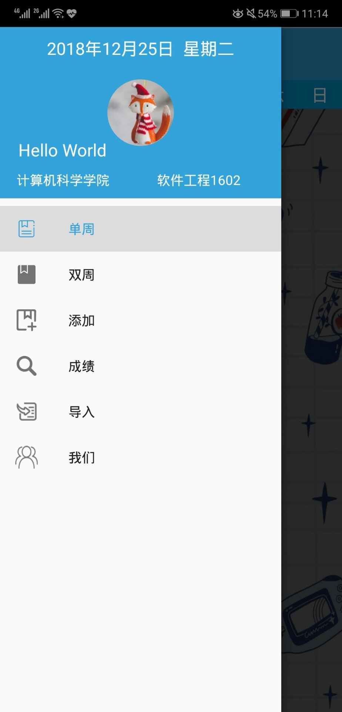
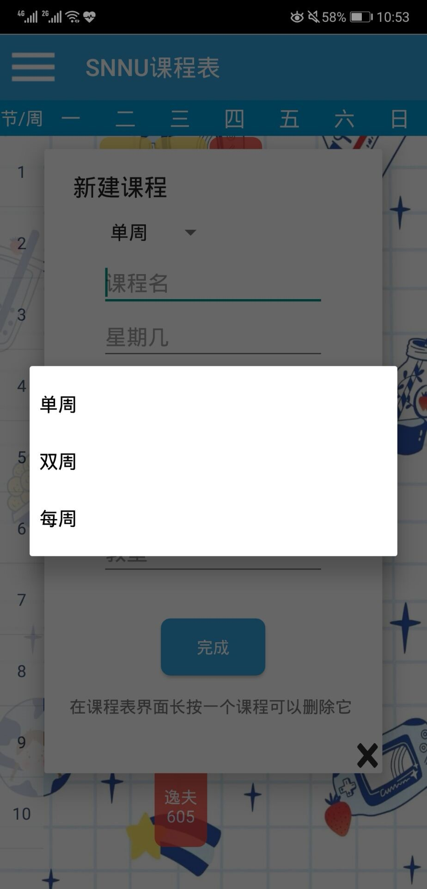
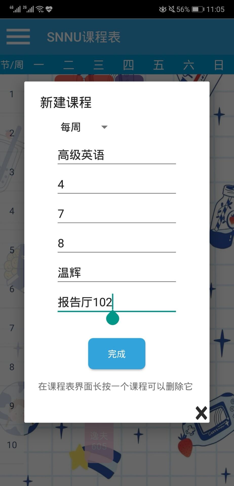
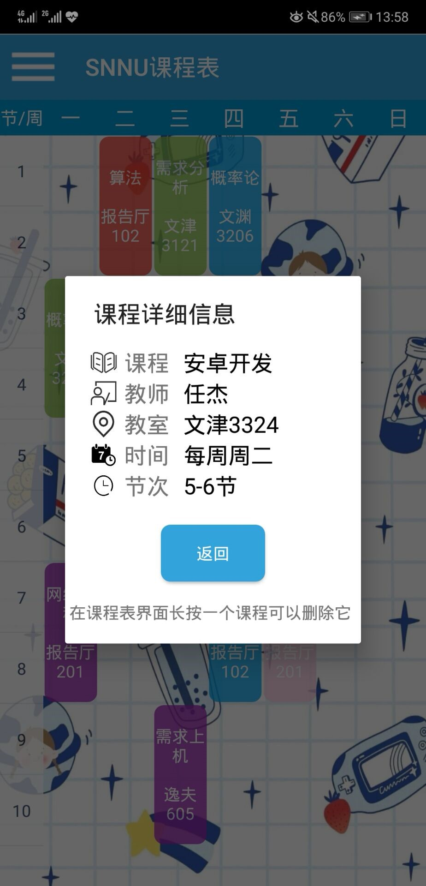
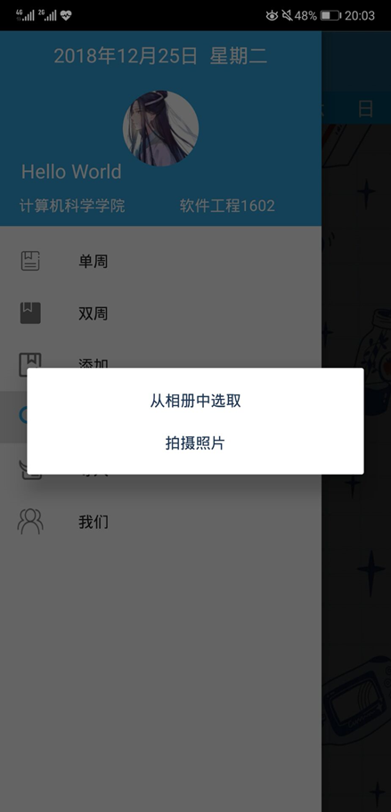
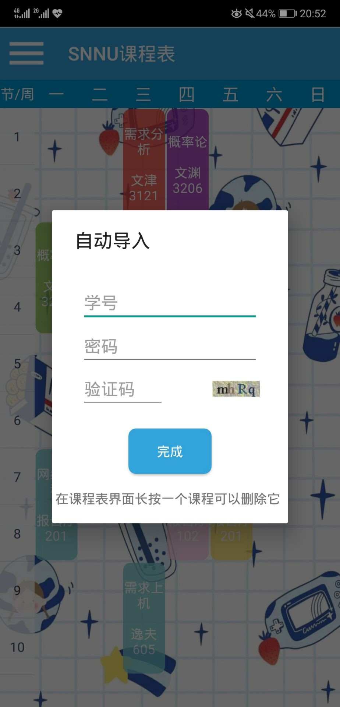

# kcb
# 基于安卓平台的课程表APP
#### 应用程序图标
在手机中运行该程序，可看到图标（见图3）被定义为了一个小企鹅的形象。
在AndroidManifest.xml中，通过语句android:icon="@mipmap/ic_launcher"实现图标的设定。

  
  Figure 1. 图标

#### 主页面
进入程序后，首页面即为课程表界面，一周课程尽在眼前。
在drawable中，定义课程格子的颜色、形状。在MainActivity中，将其存储为数组形式，在创建课程视图时，以随机数的形式进行调用，所以每次打开应用，就会显示出新的课程格子颜色。

  
  Figure 2. app主界面

 
#### 菜单栏
通过在主页面点击菜单按钮或右滑，可进入菜单栏界面。在该界面中，可查看日期、更换头像、查看单双周课程、添加课程等。
在activity_main.xml中使用DrawerLayout，在里面写入两个Layout——滑动菜单界面和主界面，在MainActivity中调用mDrawerLayout.openDrawer(GravityCompat.START)，即可实现主页面与侧滑菜单的融合。滑动菜单分为两部分，一个是header.xml，一个是menu.xml，使用了NavigationView控件。
SimpleDateFormat获取年月日信息，Calendar.DAY_OF_WEEK获取星期几的信息，再通过TextView.setText将得到的日期传给header.xml中的控制时间显示的Menu_main_textDate，从而实现菜单栏日期的动态变更。
 

  
  Figure 3. 侧边栏

### 课程的添加&查看&删除
#### 添加课程
在主页面中，点击任意空白区域，即可弹出“新建课程”界面。也在侧滑菜单中，点击“添加”，进入课程添加界面。在“新建课程”界面中，用户可进行单双周的选择以及课程其他信息的输入。输入完毕后，点击“完成”，即完成了一次课程的添加，此时，课程会实时显示在首页课程界面中。若是误触导致进入添加界面，也可通过点下方“X”号退出。
通过ArrayAdapter（数组适配器）与Spinner相结合，在添加课程的布局中实现单双周的下拉列表显示，再结合点击事件，在用户点击“完成”按钮后，若是所有信息输入无误，则这些添加的数据将被传到数据库，再通过putExtra实现AddCourseActivity与MainActivity间的课程信息传递。课程信息传递后，在MainActivity中创建课程表视图，实现新添加的课程信息的实时显示。其中，单个课程布局的高度是根据课程时间差值计算得到。若是信息填写出错或是基本信息未填写完整，通过Toast对用户的不合法信息输入进行提示。
 

  
  Figure 4. 选择单双周

  
  Figure 5. 添加课程

  
  Figure 6. 查看课程

#### 查看课程
在首页面中，点击课程格子，即可查看课程详细信息。在菜单栏中，点击“单周”或“双周”，可进入相应的单双周课程表界面。在该界面中，也可通过点击课程格子，查看相应的课程详细信息。
在activity_update_course.xml中，实现课程详情的布局，比如文字前的图标，不同的文字颜色等。在MainActivity中，监听点击事件，通过Intent.putExtra将此时被点击的课程的相关信息传递给MessageCourseActivity，获取信息后，通过TextView.setText实现对布局文件中相应显示内容的替换，从而使得点击后可以显示出相应的课程信息。其中，由于用户键入的是数字的星期数信息，为了提高课程详情界面的友好性，在MessageCourseActivity中添加getDayString(int day)方法，将数据库中存储的数字星期数（如2）转化为文字星期（如二）数后再进行输出。
在点击单双周后，相应的类文件通过执行对数据库存储的week信息的判断语句，进行数据的筛选，之后使用筛选出的数据进行单双周视图的加载。在相应的活动中，也设置了点击事件监听，使得可以通过点击课程，得到课程详情的显示。     
 

  
  Figure 7. 侧边栏选择单双周

  
  Figure 8. 单周课程展示

#### 删除课程
在主页面，点击课程可查看课程详细信息，长按课程可进行课程的删除，见，“算法”被成功删除。
设置长按监听，触发后，先将视图隐藏，再移除课程视图，最后将数据库中关于该课程的信息删去。

#### 头像更换
点击菜单栏处的头像，出现选择头像方式的弹出框，从相册选好图片或者拍摄好照片后，可进行图像的缩放与裁剪（见图 14），点击“√”后，新的头像便会出现在菜单栏中。
由于菜单栏的实现在MainActivity里，所以将更换头像的方法也全部写在了这个Java文件中。在点击头像时，触发onClick事件，从而调用showTypeDialog()方法，弹出选择框后，点击不同选项，触发不同的点击事件。无论点击哪个按钮，都会最终进入裁剪图片的步骤，在该步骤中，通过Intent intent = new Intent("com.android.camera.action.CROP")，调用系统自带的图片裁切功能，裁剪后，调用Bitmap.compress()对图像进行压缩处理后存储，之后，调用setImageBitmap将存储好的图像显示在对应的CircleImageView中。
在实现该功能时，要让使用者的手机为该APP开启存储、相机权限，所以在AndroidManifest.xml中，要添加相应的<uses-permission>语句。

  
  Figure 9. 选择更换方式
    
    Figure 10. 剪裁
    
    Figure 11. 成功更换头像

#### 登录&验证码的获取
点击菜单栏处的“导入”，可进入学号登录页面，用户输入教务系统的学号、密码后，便可实现自动导入课表的功能，不必再一个个手动录入。但是在爬虫时，虽然已经实现了动态获取验证码，但是仍无法登入教务系统，于是止步于爬取验证码的阶段。
导入Jsoup的jar包后，使用Jsoup.connect打开网址，获取此时网页中的cookie【使用connection.ignoreContentType().execute()，再将JSESSIONID和其他value值提取出来，用“;”分开】，再带着cookie访问一次验证码链接，将返回的验证码保存并显示在“自动导入”界面。

  
  Figure 13. 获取到的验证码

